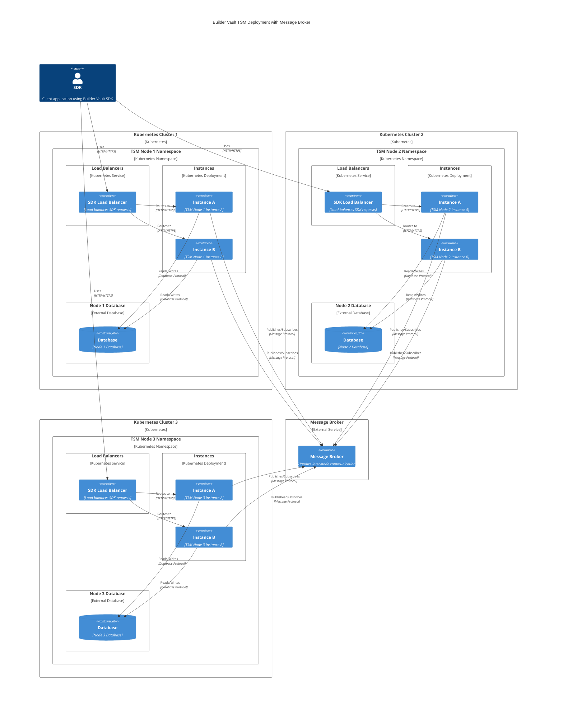

# Replicated MPC Nodes with Broker Communication using local Kind cluster

This directory has an example of deploying Replicated MPC Nodes with Message Broker Communication locally to your desktop for helm testing and development. When deploying to production, deploy each TSM node to a separate Kubernetes cluster. For more information on the Broker Communication, see the [Broker Communication](https://builder-vault-tsm.docs.blockdaemon.com/docs/message-broker-communication) and [Horizontal Scaling](https://builder-vault-tsm.docs.blockdaemon.com/docs/horizontal-scaling#replicated-mpc-nodes-with-message-broker-communication) documentation.

## Helm Repository

```shell
helm repo add builder-vault https://blockdaemon.github.io/builder-vault-helm/
helm repo update
```

## Prerequisites

Each Builder Vault TSM node must have it own configuration which it reads on startup from `/config/config.toml`. A sample config file for each node is provided: `config0.toml`, `config1.toml`, `config2.toml`. Sensitive values are interpolated using environment variables. When not testing locally, these must be retrieved from your secrets management infrastructure.

The deployed cluster will look like this:



## Deployment

### Single node Kind cluster deployment
```shell
cat <<EOF | kind create cluster --config=-
kind: Cluster
apiVersion: kind.x-k8s.io/v1alpha4
nodes:
- role: control-plane
  extraPortMappings:
  - containerPort: 80
    hostPort: 80
    protocol: TCP
EOF
```

### Nginx ingress deployment
```shell
kubectl apply -f https://kind.sigs.k8s.io/examples/ingress/deploy-ingress-nginx.yaml
```

### Deploy databases:
```shell
kubectl create namespace tsm
kubectl apply -n tsm -f db0-postgres.yaml
kubectl apply -n tsm -f db1-mysql.yaml
kubectl apply -n tsm -f db2-postgres.yaml
```

### Deploy broker:
```shell
kubectl apply -n tsm -f broker-redis.yaml
```

### Deploy each BuilderVault TSM node:
  - update tsm[0-2].yaml `image.repository` with your container registery. 
```shell
kind load docker-image <registry>/tsm-node:69.0.0
helm install tsm0 builder-vault/tsm-node --create-namespace -n tsm -f tsm0.yaml
helm install tsm1 builder-vault/tsm-node --create-namespace -n tsm -f tsm1.yaml
helm install tsm2 builder-vault/tsm-node --create-namespace -n tsm -f tsm2.yaml
```

### Benchmark
```shell
cd ../../benchmark
go run . -operation sign -ecdsaClients 25 -duration 30s -threshold 1 -signers 3 -node http://apikey0@localhost:80/tsm0 -node http://apikey1@localhost:80/tsm1 -node http://apikey2@localhost:80/tsm2
```