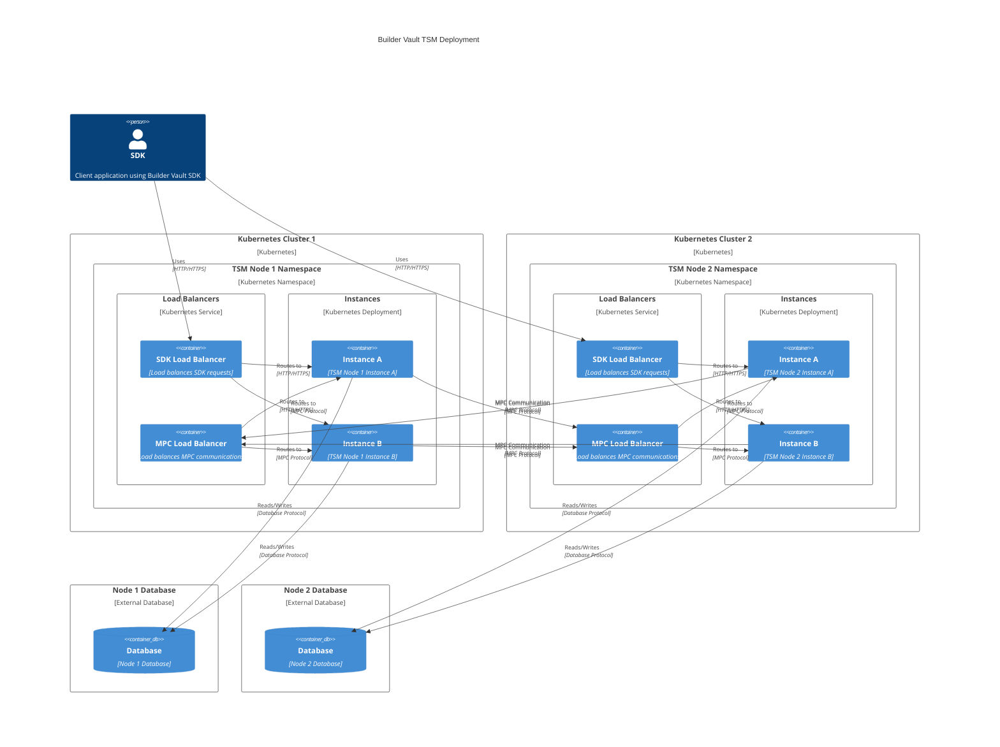

# Replicated MPC Nodes with Direct Communication

This directory has an example of deploying a multi instance TSM cluster with the tsm-node helm chart to a single kubernetes cluster.

Full documentation of the configuration can be found [here](https://builder-vault-tsm.docs.blockdaemon.com/docs/example-tsm-configuration-file).

## Helm Repository

```shell
helm repo add builder-vault https://blockdaemon.github.io/builder-vault-helm/
helm repo update
```

## Prerequisites

The deployed cluster will look like this:



Each Builder Vault TSM node must have it own configuration which it reads on startup from `/config/config.toml`. A sample config file for each node is provided: `config0.toml`, `config1.toml`, `config2.toml`. You have the option to inject these config files from either a `Kubernetes Secret` or `CSI Secret Store`. This is configured through the helm values `.values.nodeConfig`.

In this example, the `tsm0.yaml`, `tsm1.yaml` and `tsm2.yaml` are already set to use the `Kubernetes Secret` class. For example `tsm0.yaml` set to `.values.nodeConfig.configSecretName: tsm0-tsm-node`. To continue with this approach, create the Kubernetes Secrets in step 1 below. The secrets themselves are not created with helm install.


### Secrets Management options:

#### 1. Kubernetes Secret Class
Follow the steps below to use the Kubernetes Secret generic class. Note that while each node has a unique sample filename, every TSM node expects the file on the same path `/config/config.toml`.
1. Create the secret object
```shell
$ kubectl create secret generic --from-file=config.toml=config0.toml --namespace <namespace> tsm0-tsm-node
secret/tsm0-tsm-node created
```
2. Update the helm values.yaml for each node with its corresponding secret name:
```yaml
nodeConfig.configSecretName: tsm0-tsm-node
```

#### 2. CSI Secret Stores class
Follow the steps below to use the CSI Secret Store class. Review the relevant secret manager documentation beforehand. Some common examples are:<br>
[AWS Secret Manager](https://docs.aws.amazon.com/secretsmanager/latest/userguide/integrating_csi_driver_SecretProviderClass.html)<br>
[Azure Key Vault](https://learn.microsoft.com/en-us/azure/aks/csi-secrets-store-driver)<br>
[GCP Secret Manager](https://cloud.google.com/secret-manager/docs/secret-manager-managed-csi-component)


1. Create the secret in the secret management system.
2. Ensure the CSI Secrets Store driver is installed for the Kubernetes cluster and that TSM nodes have the releveant privages to read the secret.
3. Create the Kubernetes SecretProviderClass to point to the secret. Example AWS SecretProviderClass specification:
```yaml
apiVersion: secrets-store.csi.x-k8s.io/v1
kind: SecretProviderClass
metadata:
  name: tsm0-tsm-node
spec:
  provider: aws
  parameters:
    region: us-east-1
    objects: |
      - objectName: "arn:aws:secretsmanager:us-east-1:111122223333:secret:tsm0-tsm-node-ABCDE"
        objectType: "secretsmanager"
        objectAlias: "config.toml"
```

4. Update the helm values.yaml `.values.nodeConfig.configCSISecretStore` for each node with the new CSI Secret Store parameters:
```yaml
nodeConfig:
  configCSISecretStore:
    csi:
      driver: secrets-store.csi.k8s.io
      readOnly: true
      volumeAttributes:
        secretProviderClass: "tsm0-tsm-node"
```

### Additional infrastructure considerations
In addition to secrets management the following changes may need to be added:
#### Ingress Class name and annotations. AWS example:
```yaml
ingress:
  className: "alb"
  annotations:
    alb.ingress.kubernetes.io/scheme: internet-facing
    alb.ingress.kubernetes.io/certificate-arn: <acm certificate arn>
    alb.ingress.kubernetes.io/healthcheck-path: /ping
```
#### Confidential Computing nodeSelector. Azure example:
```yaml
nodeSelector:
  kubernetes.azure.com/security-type: ConfidentialVM
```

## Deployment

To deploy the BuilderVault, perform the helm deployment for each TSM node:
```
helm install tsm0 blockdaemon/tsm-node --create-namespace -n tsm -f tsm0.yaml
helm install tsm1 blockdaemon/tsm-node --create-namespace -n tsm -f tsm1.yaml
helm install tsm2 blockdaemon/tsm-node --create-namespace -n tsm -f tsm2.yaml
```

